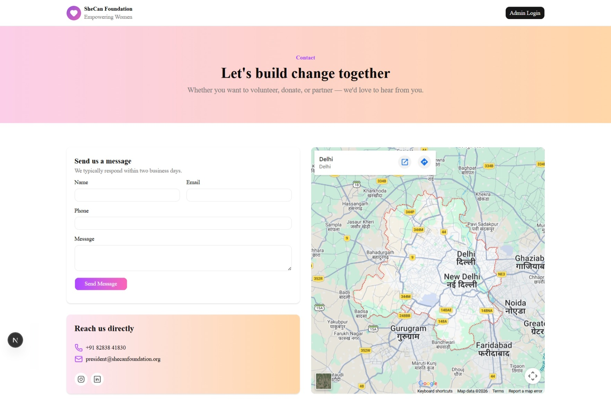
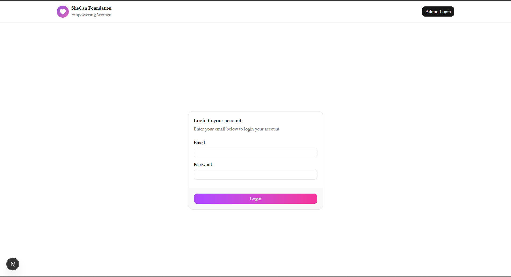
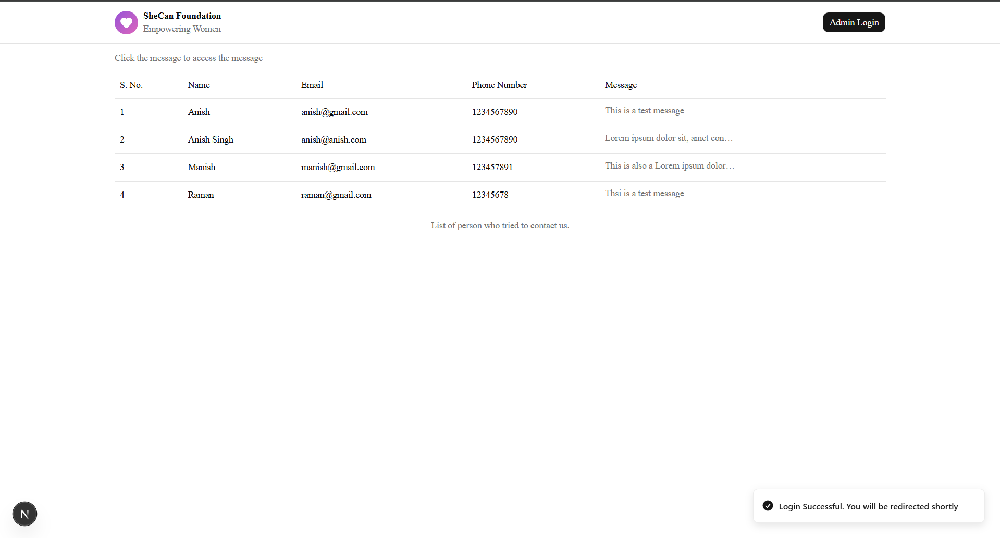

# SheCan Foundation — Contact Management System

A full-stack web application for the SheCan Foundation that allows visitors to submit contact inquiries and enables admins to manage them through a secure dashboard.

---

## Tech Stack

**Frontend**

- Next.js 16 (App Router, Turbopack)
- React 19
- TypeScript
- Tailwind CSS v4
- shadcn/ui + Base UI
- Sonner (toast notifications)

**Backend**

- Node.js + Express 5
- MongoDB + Mongoose
- JWT (HttpOnly cookies)
- express-validator
- bcryptjs

---

## Features

- **Contact Page** — Public form for visitors to submit their name, email, phone, and message
- **Login Page** — Single admin login with JWT authentication via HttpOnly cookies
- **Dashboard Page** — Protected page displaying all contact submissions in a table with message popover preview
- **Security** — JWT stored in HttpOnly cookies; `Secure` flag enabled in production; route-level `authenticate` middleware protects all admin endpoints

---

## Pages

### Contact Page

Visitors fill out a form to get in touch. Includes an embedded Google Maps iframe and direct contact details (phone, email, social links).



### Login Page

Admin-only login. Credentials are validated server-side; on success a signed JWT is set as an HttpOnly cookie.



### Dashboard Page

Protected route. Lists all contact submissions with serial number, name, email, phone, and a truncated message preview. Clicking the message opens a popover with the full text.



---

## Project Structure

```
/
├── client/                  # Next.js frontend
│   ├── app/
│   │   ├── page.tsx         # Contact form page
│   │   ├── login/page.tsx   # Admin login
│   │   └── dashboard/page.tsx  # Contact submissions dashboard
│   └── components/
│       └── app/
│           ├── ContactForm.tsx
│           └── Header.tsx
│
└── server/                  # Express backend
    └── src/
        ├── controllers/
        ├── services/
        ├── models/
        ├── routes/
        ├── middleware/
        ├── validators/
        └── utils/
```

---

## Getting Started

### Prerequisites

- Node.js 18+
- MongoDB instance (local or Atlas)

### Backend

```bash
cd server
npm install
```

Create a `.env` file:

```env
PORT=4001
MONGO_URI=your_mongodb_connection_string
JWT_SECRET=your_jwt_secret
CLIENT_URL=http://localhost:3000
ADMIN_EMAIL=admin@admin.com
ADMIN_PASS=pass_for_admin
```

```bash
npm run dev
```

### Frontend

```bash
cd client
npm install
```

Create a `.env.local` file:

```env
NEXT_PUBLIC_BACKEND_URL=http://localhost:4001/api
```

```bash
npm run dev
```

Open [http://localhost:3000](http://localhost:3000).

---

## API Endpoints

| Method | Endpoint           | Auth | Description                 |
| ------ | ------------------ | ---- | --------------------------- |
| POST   | `/api/contact`     | ✓    | Submit a contact form       |
| GET    | `/api/contact`     | ✓    | Get all contact submissions |
| DELETE | `/api/contact/:id` | ✓    | Delete a contact entry      |
| POST   | `/api/auth/login`  | ✗    | Admin login                 |

---

## Author

**Anish Kumar Singh**
